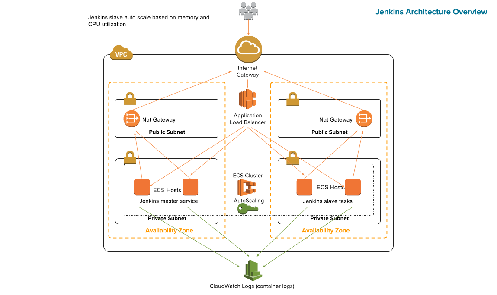

# Deploying Jenkins as microservice with Amazon ECS, AWS CloudFormation, and an Application Load Balancer

You can launch this CloudFormation stack in the US East (N. Virginia) Region in your account:

## Overview



The repository consists of a set of nested templates that deploy the following:

## Getting started

###  Generating KMS key id

1. Go to IAM Service on the aws console (https://console.aws.amazon.com/iam/home?region=us-east-1#encryptionKeys)
2. Click on Create Key
	- Name accordingly and select key Material Origin KMS
3. Give permission accordingly 
4. Note Key ID

### Encrypting user's private key and uploading to s3

1. Install aws cli and configure the cli (http://docs.aws.amazon.com/cli/latest/userguide/installing.html)
2. Encrypting the private key
```
       aws --region us-east-1 kms encrypt --key-id <KEY ID GENERATED IN ABOVE STEP> --plaintext fileb://~/.ssh/id_rsa --query CiphertextBlob --output text | base64 --decode > id_rsa
```
3. Upload encrypted id_rsa to s3 bucket through awscli 
```
       s3cmd put id_rsa s3://<s3-BUCKET NAME>/id_rsa
```


### Build docker images of jenkins master and slave and upload to ECR

1. Create an EC2 Container Registry by choosing the EC2 container service and choosing the Repositories option and click the icon create-repository and fill up the appropriate information such as repository name. Note the repository name which will be used in below steps.

2. Note the repository uri which will be used to push the jenkins images

3. Go the src directory of this cloned repository.
```
         cd services/src
```

   - Build jenkins master image by the main Dockerfile but keep the name of the image same as the ECR name which you have created earlier
```
        docker build -t <ECR NAME>:latest .
   Example-
        docker build -t nclouds-jenkins/jenkins:latest .
```

  - Build jenkins slave image by the Dockerfile.slave
```
        docker build -t <ECR NAME>:slave -f Dockerfile.slave .
   Example-
        sudo docker build -t nclouds-jenkins/jenkins:slave -f Dockerfile.slave .
```

  - Push the build images to the ECR
```
For master image:-
     docker tag <ECR NAME>:latest <ECR URI ADDERESS>:latest
     docker push ECR URI ADDERESS>:latest
   Example-
     docker tag docker tag nclouds-jenkins/jenkins:latest 123456789012.dkr.ecr.us-east-1.amazonaws.com/nclouds-jenkins/jenkins:latest
     docker push 123456789012.dkr.ecr.us-east-1.amazonaws.com/nclouds-jenkins/jenkins:latest

For slave image:-
    docker tag <ECR NAME>:slave <ECR URI ADDERESS>:slave
    docker push <ECR URI ADDERESS>:slave
  Example-
    docker tag nclouds-jenkins/jenkins:slave 123456789012.dkr.ecr.us-east-1.amazonaws.com/nclouds-jenkins/jenkins:slave
    docker push 123456789012.dkr.ecr.us-east-1.amazonaws.com/nclouds-jenkins/jenkins:slave

```

### Customize the jenkins.yaml template

1. Clone the GitHub repository to your local machine.
2. Make modification on these values to the jenkins.yaml template
      - set KeyName to the name of the key which will be further used to login the ECS instance.
      - set ECSInstanceType to your's requirement. Currently it has been set to t2.large
      - set ECSClusterSize to the total number of instances in the ECS cluster. Currently it has been set to 1.
      - set Bucket to the name of the bucket where you have uploaded your's encrypted private key and known_hosts file.
      - set RegionName you want your cluster be launched. Region name should be same as the region name of bucket.
      - set AccountNumber to your's own ECS account number.
      - set JenkinsPassword to the password of your's choice. Currently the default password is S5P$m\q7LFWsMdYh
      - set RepositoryName to the ECR repo where the images of jenkins master and slave will reside. 
      - set JenkinsTag to the latest image tag of the jenkins master image which  you have build with the main Dockerfile
      - set SlaveTag to the latest image tag of the jenkins slave image which you have build with the Dockerfile.slave


### Upload the templates to the s3 bucket

1. Create two folders infrastructure and services inside s3 bucket.
2. Copy all of the templates under infrastructure directory to infrastructure directory of the s3 bucket
3. Copy service.yaml template under the services directory to the services directory of the s3 bucket. 