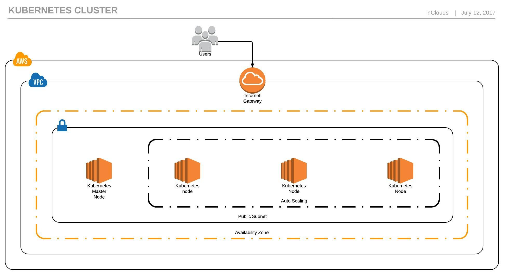

# Deploying Jenkins as microservice with Kubernetes and AWS CloudFormation

This templates launches a Kubernetes cluster using kubeadm in an existing subnet. It installs weave as the network driver and helm as package manager in all the nodes. During launch its better to have all ports open and after launch completes restrict access as your services require.
You can launch this CloudFormation stack in the US East (N. Virginia, Ohio) or US West (N.California, Oregon) Region in your account:

# Overview



# Getting started

##  Deploying the kubernetes cluster

1. First we need to have the CloudFormation templates in `/kubernetes-workflow/cf-templates/` stored in S3. Create a new bucket or use an existing one.
2. Go to your aws console and create a new CloudFormation Stack. Select `/kubernetes-workflow/cf-templates/main.yml` as the template.
3. Fill in the necessary parameters to customize the cluster. Remember to input the name of the bucket you used in step 1.
4. Once the stack deployment is completed you can get the public IP of the master node from the stack's output values.
5. ssh into the master node and run: `kubectl get nodes`, to check that all the nodes are online and ready.

## Deploying Jenkins

## Pulling jenkins image from public repository

1. Copy the folder `/kubernetes-workflow/jenkins-helm-chart/` to the master node. You can copy via scp or with git cloning this repository.
2. Fill in the parameters in `/kubernetes-workflow/jenkins-helm-chart/values.yaml`
3. Run:
```bash
helm install ./kubernetes-workflow/jenkins-helm-chart/
```

## Pulling jenkins image from ECR
For this part to work you need to configure aws access keys in the master node that have ECR permissions or assign a role with the required permissions to the master instances.

1. Copy the folder `/kubernetes-workflow/jenkins-helm-chart/` to the master node. You can copy via scp or with git cloning this repository.
2. Fill in the parameters in `/kubernetes-workflow/jenkins-helm-chart/values.yaml`
3. As root run the following commands:
```bash
aws ecr get-login --no-include-email --region us-east-1 | sh -
cat > /tmp/image-pull-secret.yaml << EOF
apiVersion: v1     
kind: Secret
metadata:
  name: myregistrykey
data:
  .dockerconfigjson: $(cat ~/.docker/config.json | base64 -w 0)
type: kubernetes.io/dockerconfigjson
EOF
```
4. As regular user run the following command:

```bash
sudo kubectl create -f /tmp/image-pull-secret.yaml
```

3. Run:
```bash
helm install ./kubernetes-workflow/jenkins-helm-chart/
```
